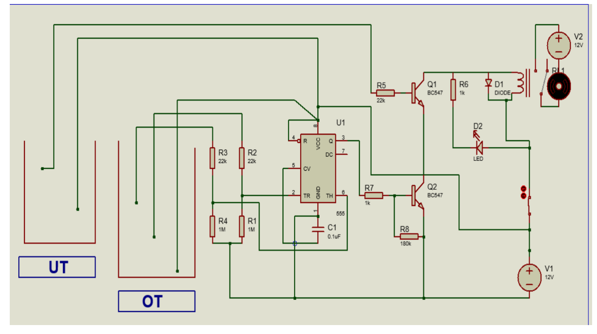

Introduction:
An automatic water pump controller system is designed to automate water management for efficient use in residential or industrial settings. The system detects water levels in both an underground and an overhead tank, using sensors to monitor these levels in real time. 

Component Required:
555 Timer IC 
BC547 NPN Transistor 
1k ohm Resistors 
22k ohm Resistors 
180k ohm Resistor 
1M ohm Resistors 
LED 1.5V 5-mm 
1N4007 Diode 
100nF (104) Capacitor 
12V SPDT Relay (Contact Rating 30A) 
Connectors & IC base (4 pins)

Description of the system:
1.Sensors detect water levels in the underground and overhead tanks.
2.When the overhead tank's water level drops, the sensor triggers the 555 timer.
3.The 555 timer activates a relay, which starts the water pump.
4.Water is pumped from the underground tank to the overhead tank.
5.Once the overhead tank is full, the sensor turns off the relay, stopping the pump.
6.The pump also stops if the underground tank is empty.
7.Manual override and emergency stop provide user control.

